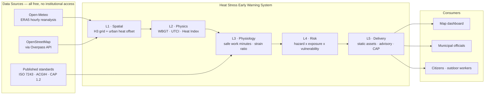
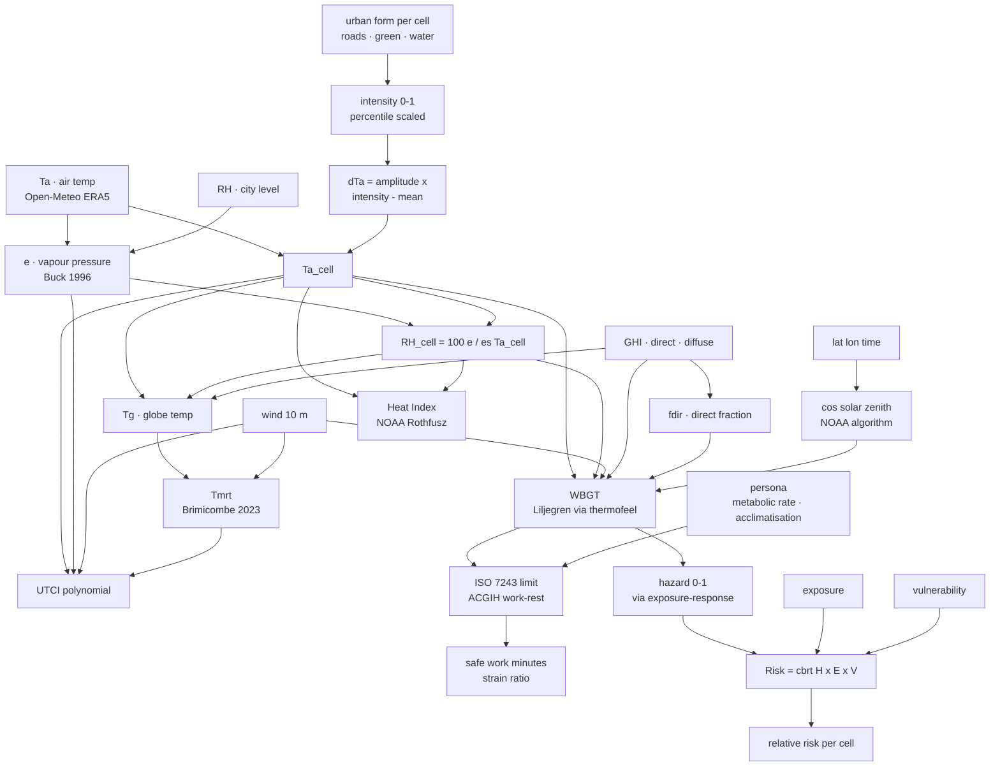
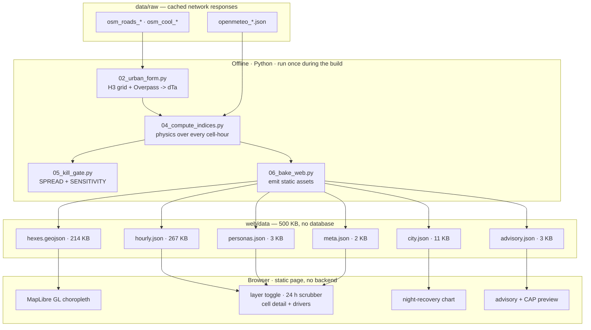
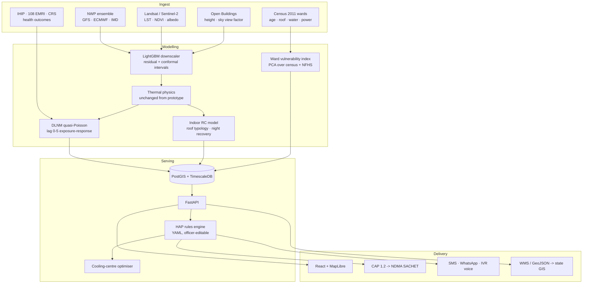

# System Architecture
## Heat Stress Early Warning — Human Thermal Stress Index

Describes the system **as built**. Where the implemented design differs from the
original plan, the change and its reason are recorded — those deltas are among
the more defensible parts of the work.

---

## 1. System Context



---

## 2. Physics Computation Graph — the technical core

This is the mechanism that distinguishes the project; everything downstream is
presentation.



### 2.1 The humidity decision — the subtlest part of the design

When the urban heat island warms a cell, **it does not add water to the air.**
So the pipeline carries **vapour pressure** across cells and recomputes relative
humidity per cell:

```
RH_cell = 100 · e_city / es(Ta_cell)
```

Holding RH fixed instead would invent moisture in exactly the hottest cells and
overstate their humid heat stress — an error that biases the result in the
direction we *want* it to go, which is the most dangerous kind.

### 2.2 Measured consequence: WBGT damps, UTCI amplifies

For the same 3.00 °C intra-city air-temperature spread:

| metric | spread | ratio to air temp |
|---|---|---|
| air temperature | 3.00 °C | 1.00 |
| **WBGT** | **1.39 °C** | **0.46 — damped** |
| **UTCI** | **3.88 °C** | **1.29 — amplified** |
| Heat Index | 3.10 °C | 1.03 |

A hotter cell is a *drier* cell, and WBGT is 70 % weighted on wet bulb — so its
temperature and humidity terms partly cancel. UTCI, driven by air temperature and
radiant load, does the opposite.

**Architectural consequence:** the map layer is not a fixed choice. For a dry
heatwave UTCI is the correct layer; for a humid one WBGT is. Index selection is
per-city and per-event.

---

## 3. Prototype Architecture — deliberately serverless



**Why no backend.** All data is precomputed and immutable for a fixed historical
date. A static page is simpler to build, better looking than a notebook UI, and
— decisively — **cannot fail on stage**. NFR-1 is satisfied by construction
rather than by discipline.

---

## 4. Data Flow Sequence

```mermaid
sequenceDiagram
    autonumber
    participant Dev as Operator
    participant OM as Open-Meteo
    participant OV as Overpass
    participant Core as heatstress core
    participant Web as web/data

    Dev->>Core: 02_urban_form.py
    Core->>Core: H3 tessellation of city bbox
    loop 16 tiles, each cached separately
        Core->>OV: roads (out geom)
        Core->>OV: green + water (one request, split by tag)
        OV-->>Core: vectors  (504s retried with backoff)
    end
    Core->>Core: percentile scale -> intensity -> dTa
    Core-->>Dev: urban_form_<city>.json

    Dev->>Core: 04_compute_indices.py
    Core->>OM: hourly ERA5 for hindcast window
    OM-->>Core: T, RH, wind, GHI, direct, diffuse, pressure
    Core->>Core: Ta_cell; recompute RH at constant vapour pressure
    Core->>Core: Liljegren WBGT · UTCI · Heat Index · risk
    Core-->>Dev: indices_<city>.npz  (392 x 264 cell-hours)

    Dev->>Core: 05_kill_gate.py
    Core-->>Dev: spread, damping ratios, amplitude sensitivity, VERDICT

    Dev->>Core: 06_bake_web.py
    Core->>Web: 6 static files, 500 KB
    Web-->>Dev: opens from file:// with the network off
```

---

## 5. Module Map

```
src/heatstress/
├── psychro.py        Buck 1996 saturation vapour pressure, Stull wet bulb,
│                     dew point, specific humidity
├── solar.py          NOAA solar position (declination, equation of time,
│                     cos solar zenith), Erbs 1982 direct-beam fraction
├── thermal.py        Heat Index (own Rothfusz) · globe temp · ISO 7726 MRT ·
│                     WBGT · thermofeel wrappers (Liljegren, UTCI) · bands
├── physiology.py     Personas, ISO 7243 limits, ACGIH work-rest allocation,
│                     strain ratio, per-persona assessment
├── spatial.py        H3 tessellation, GeoJSON emission, UrbanIntensity,
│                     urban heat offset, UrbanFormSource protocol
├── vulnerability.py  VulnerabilitySurface, PlaceholderVulnerability,
│                     IPCC risk composition
├── risk.py           ExposureResponse, relative risk, lag kernel,
│                     hazard normalisation, calibrate() seam
├── advisory.py       Multilingual advisory copy, severity bands,
│                     CAP 1.2 XML emitter
└── sources/
    ├── openmeteo.py  ERA5 archive client, disk-cached, unit-asserted
    └── osm.py        Overpass client: tiling, backoff, endpoint rotation,
                      percentile scaling
```

### 5.1 Two independent implementations, on purpose

Every headline index is computed twice: once by our own from-scratch code, once
by `thermofeel` (ECMWF's operational library). They are cross-checked in the test
suite.

| quantity | ours | reference | agreement |
|---|---|---|---|
| Heat Index | Rothfusz + NWS adjustments | `thermofeel` | 0.1 °F |
| Mean radiant temp | ISO 7726 inversion | Brimicombe 2023 | **0.005 °C** |
| Wet bulb | Stull 2011 | published worked example | exact (13.70 °C) |
| Sat. vapour pressure | Buck 1996 | steam tables | 0.017 % at 100 °C |

Two independent implementations agreeing is far stronger evidence than one
implementation agreeing with itself — and a better answer to *"how do you know
your numbers are right?"* than any accuracy percentage.

---

## 6. Design Decisions & Their Reasons

| # | Decision | Reason |
|---|---|---|
| D1 | **H3 hexagons, not municipal wards** | Ward shapefiles are a multi-day scavenge with no learning value. H3 tessellates any city instantly and every cell has identical area, so per-cell statistics are directly comparable — which is not true of wards. |
| D2 | **OpenStreetMap urban form, not satellite LST** | No registration or approval wait; pure JSON so no GeoTIFF/GDAL dependency; works for any city immediately. Same signal WUDAPT Local Climate Zones encode, computed from vectors. |
| D3 | **`thermofeel`, not `pythermalcomfort`** | Forced: Windows Application Control blocks a `scipy.optimize` DLL. Turned out better — `thermofeel` ships the full **Liljegren** WBGT model, retiring assumption A2. |
| D4 | **ISO 7243 + ACGIH, not ISO 7933 PHS** | Consequence of D3. Lookup tables rather than an ODE: no solver to fail on stage, and it is what occupational hygienists actually use, so output maps onto a decision an official can sign. |
| D5 | **Hindcast, not forecast** | Forecasting is a separate ML problem that does not test the core assumption, and it is more persuasive to replay a real event you can point at afterwards. |
| D6 | **Static files, no database** | Data is precomputed and immutable. Simpler, prettier, and cannot fail on stage. |
| D7 | **Percentile normalisation, not fixed caps** | A fixed 12 km road cap pinned most of Ahmedabad's core to 1.0 (median intensity 0.975), flattening the dense inner city into one colour. Percentile scaling also makes the pipeline portable — an absolute threshold tuned on Ahmedabad would mis-scale Chennai. |
| D8 | **Vapour pressure carried across cells** | See §2.1. Prevents a bias that would have flattered the result. |
| D9 | **CAP `status=Exercise`, never `Actual`** | A prototype must not emit something real alerting infrastructure would act on. |
| D10 | **Alert dispatch deliberately unwired** | An alerting system that can fire during a demo is a liability. Advisory and CAP are returned as strings for display only. |

---

## 7. Honesty Architecture

Caveats are carried as **data**, not documentation, so the UI cannot silently
drift from the truth. `meta.json` tags every layer:

| layer | source | status |
|---|---|---|
| weather | Open-Meteo ERA5 | `measured` |
| urban form | OpenStreetMap / Overpass | `measured` |
| thermal indices | thermofeel (Liljegren, UTCI) | `measured` |
| physiology | ISO 7243 + ACGIH | `published standards` |
| **UHI amplitude** | literature value | **`ASSUMED — not fitted locally`** |
| **vulnerability** | placeholder | **`NOT FITTED`** |
| **health risk** | literature-shaped | **`NOT CALIBRATED`** |

Enforced by tests: `PlaceholderVulnerability` must report `is_placeholder=True`,
`DEFAULT_WBGT_RESPONSE.is_calibrated` must be `False`, unverified translations
must be flagged, and every advisory string must pass a script-integrity check.

> That last test exists because an early draft of the Gujarati advisory contained
> a stray digit **and a Lao codepoint** — invisible to anyone who cannot read the
> script, and the kind of corruption that turns a safety instruction into
> nonsense.

---

## 8. Target Architecture `[V1]`



### Migration seams already in place

The prototype was built so production is a substitution, not a rewrite:

- `spatial.UrbanFormSource` — protocol; add a Landsat LST source, nothing downstream changes.
- `vulnerability.VulnerabilitySource` — protocol; swap the placeholder for a census-backed surface.
- `risk.ExposureResponse.calibrate()` — returns a calibrated copy; the seam where real health records enter.
- `config/<city>.yaml` — every city-specific value; the code contains no Ahmedabad constants.
